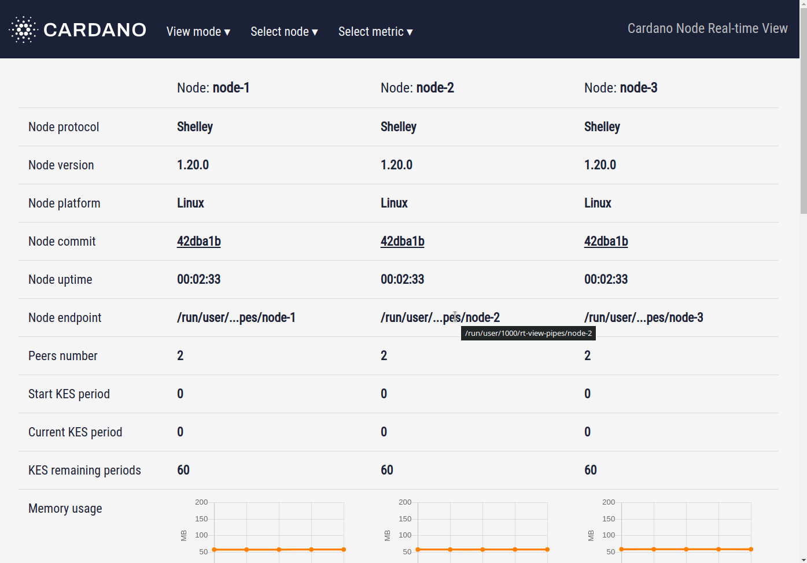

# GUI Overview: Grid mode

The page in grid mode displays the table where columns correspond to the nodes, and rows correspond to the metrics.

## Select node

At the top bar of the page, you will find the dropdown list `Select node`. Here you can select the nodes you want to see:

1. Check the checkbox if you want to see the corresponding panel;
2. Uncheck it if you're going to hide it.

## Select metric

At the top bar of the page, you will find the second dropdown list `Select metric`. Here you can select the metric you want to see:

1. Check the checkbox if you want to see the corresponding metric;
2. Uncheck it if you're going to hide it.

## Tooltips

As in Pane mode, the table in Grid mode contains metrics. For example, `Node protocol`, `Node version`, `Node endpoint`, etc. If you hover a mouse on the metric's name - in the left cell of each row - you will see a tooltip with short information about this metric.

