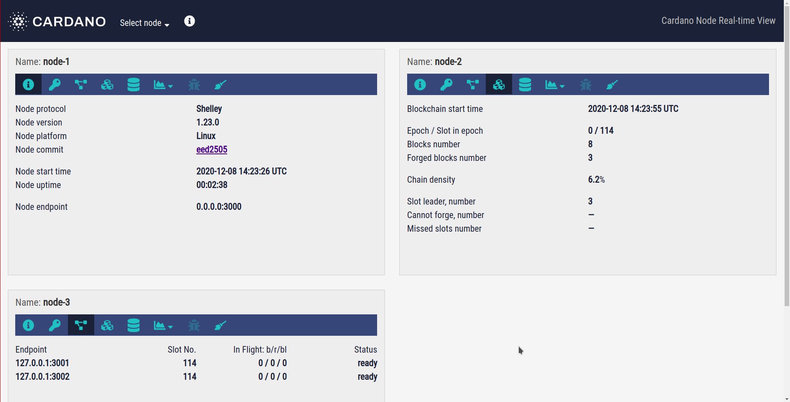

# GUI Overview

RTView displays nodes' metrics on the web-page. All the metrics received from a particular node will be shown inside a panel.

The top bar of each panel shows the `Name`. This is the name of the particular node you chose during RTView interactive dialog. For example, if you picked the default option for nodes' names, the `Name` in the first panel will be `node-1`.

## Select node

At the top bar of the page, you will find the dropdown list `Select node`. Here you can select the nodes you want to see:

1. Check the checkbox if you want to see the corresponding panel;
2. Uncheck it if you're going to hide it.

## Tabs

Each panel has the following tabs:

1. `Node info` - shows necessary information about the node;
2. `Key Evolving Signature` - KES-related information;
3. `Peers` - displays information about the peers of this node;
4. `Blockchain` - offers blockchain data (epochs, slots, blocks, etc.);
5. `Mempool` - shows the mempool and transactions information;
6. `Resources` - shows resources consumed by the node (memory, CPU, disk, network);
7. `Errors` - shows the error messages received from the node;
8. `RTS GC` - shows GHC's runtime system information.

## Tooltips

Each tab contains some metrics. For example, `Node info` tab includes metrics `Node protocol`, `Node version`, `Node endpoint`, etc. If you hover a mouse on the metric's name - you will see a tooltip with short information about this metric.
