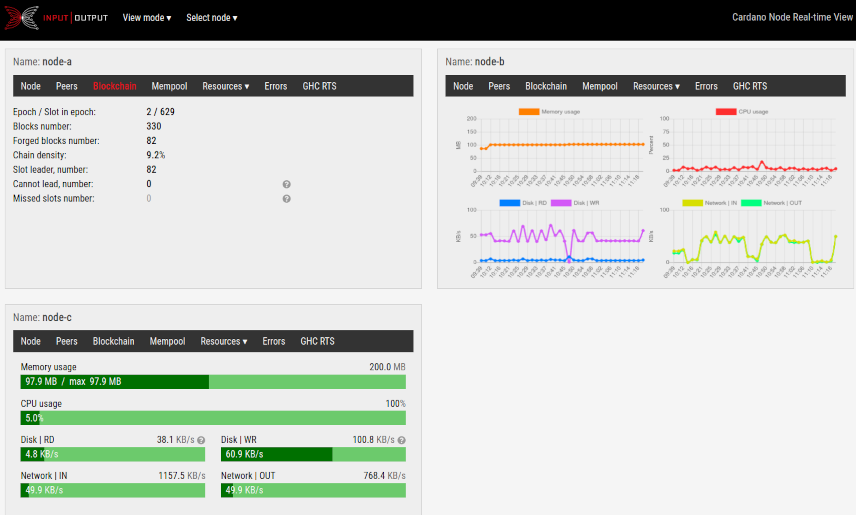

# GUI Overview: Pane mode

Pane mode shows all the metrics received from a particular node inside a panel.

The top bar of each panel shows the `Name`. This is the name of the particular node you chose during RTView interactive dialog. For example, if you picked the default option for nodes' names, the `Name` in the first panel will be `node-1`.

## Select node

At the top bar of the page, you will find the dropdown list `Select node`. Here you can select the nodes you want to see:

1. Check the checkbox if you want to see the corresponding panel;
2. Uncheck it if you're going to hide it.

## Tabs

Each panel has the following tabs:

1. `Node` - shows necessary information about the node;
2. `Peers` - displays information about the peers of this node;
3. `Blockchain` - offers blockchain data (epochs, slots, blocks, etc.);
4. `Mempool` - shows the mempool and transactions information;
5. `Resources` - shows resources consumed by the node (memory, CPU, IO);
6. `Errors` - shows the error messages from the node;
7. `GHC RTS` - shows GHC's runtime system information.

### Node

This tab shows necessary information about the node:

* `Node release` - node's release (for example, `Shelley`);
* `Node version` - version of the node;
* `Node platform` - a platform the node is working on (for example, `Linux`);
* `Node commit` - git commit the node was built from;
* `Node uptime` - how long the node is working;
* `Start KES period` - certificate KES (Key Evolving Signature) start period;
* `KES period` - current KES period;
* `KES remaining` - KES periods until expiry;
* `TraceAcceptor endpoint` - network socket or the pipe used to connect this node with RTView.

For more information about KES, please read ["Key Evolving Signature and KES period" article](https://docs.cardano.org/projects/cardano-node/en/latest/stake-pool-operations/KES_period.html).

### Peers

This tab shows the list of peers of the node. Each row contains the following information:

* `Endpoint` - connection point of this peer (this value is taken from the topology of your cluster);
* `Slot No.` - the current slot as reported by this peer;
* `In Flight Bytes` - the sum of the byte count of blocks expected from all in-flight fetch requests;
* `In Flight Reqs` - the number of blocks fetch requests that are currently in-flight;
* `In Flight Blocks` - the points for the set of blocks that are currently in-flight;
* `Status` - peer's status (for example, `ready` or `shutdown`).

### Blockchain

This tab displays blockchain-related information:

* `Epoch / Slot in epoch` - the number of current epoch / the number of the current slot;
* `Blocks number` - the number of blocks in this blockchain;
* `Forged blocks number` - the number of blocks forged by this node;
* `Chain density` - chain density, in percents;
* `Slot leader, number` - the number of slots when this node was a leader;
* `Cannot lead, number` - the number of slots when this node was a leader but because of misconfiguration (for example, invalid key), it's impossible to forge a new block;
* `Missed slots number` - the number of slots when this node was a leader but didn't forge a new block.

### Mempool

This tab provides information about the current state of the mempool

* `Mempool | bytes` - the number of transactions in the mempool, in bytes;
* `Mempool | TXs` - the number of transactions in the mempool;
* `TXs processed` - the number of processed transactions in this blockchain. These transactions are already removed from the mempool so that we can treat them as completely processed.

### Resources

This tab displays resources consumed by the node. There are two modes available: `Bars view` and `Charts view`. The first one uses progress bars, the second one uses charts. 

* `Memory usage` - how much memory is consumed by the node, in MB;
* `CPU usage` - how many CPU is used by the node, in percents;
* `Disk | RD` - node's disk activity, **read**-operations, in KB/s;
* `Disk | WR` - node's disk activity, **write**-operations, in KB/s;
* `Network | IN` - node's network activity, **input**-operations, in KB/s;
* `Network | OUT` - node's network activity, **output**-operations, in KB/s.

### Errors

This tab shows the list of errors received from the node.

Every line contains a timestamp and error message. Please note that timestamp corresponds to when this error occurred, not when RTView received this metric.

### GHC RTS

Since Cardano node is a program written in the Haskell programming language and compiled using GHC, RTView is receiving the metrics from GHC's runtime system and displaying them in `GHC RTS` tab:

* `RTS live memory` - total amount of live data in the heap, in MB (updated after every GC);
* `GC CPU time` - total CPU time used by the GC, in seconds;
* `GC time elapsed` - total elapsed time used by the GC, in seconds;
* `Number of GC runs` - total number of GCs;
* `Major GC runs` - total number of major (oldest generation) GCs.
